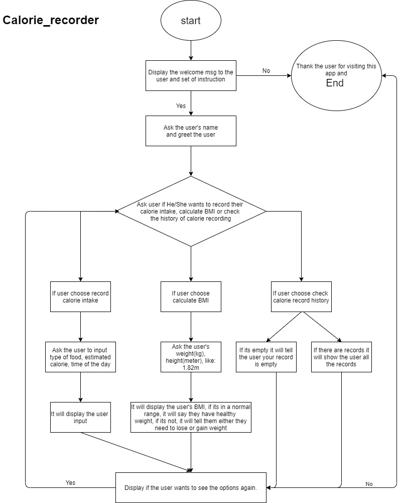
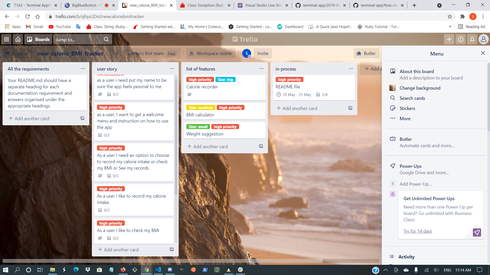
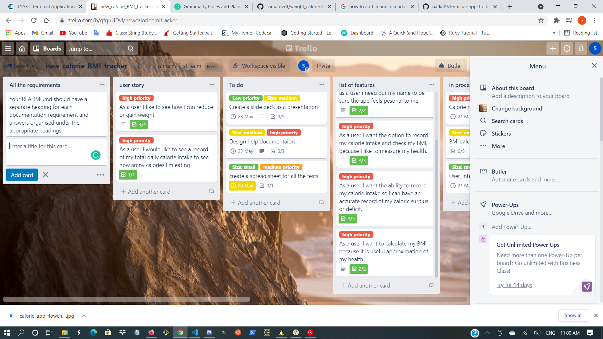
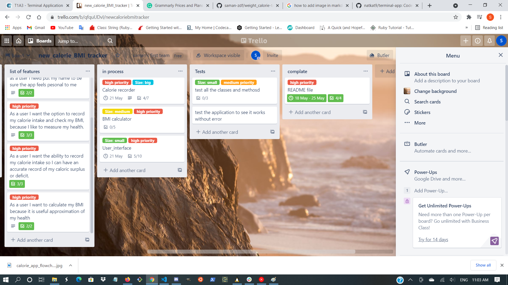
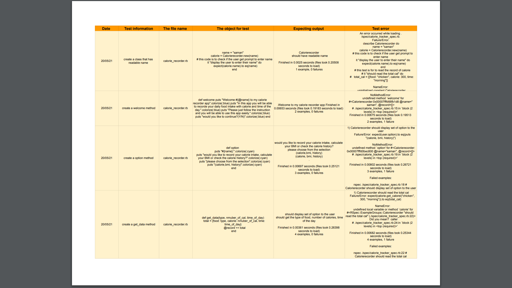
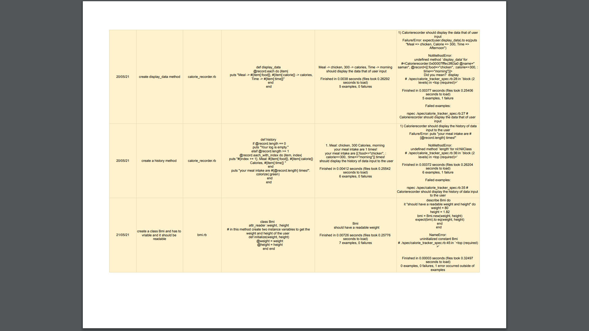

# Welcome to my Calorie recorder App.

### link below is for my github repository

[Github repository](https://github.com/saman-zdf/weight_calorie-tracker)

### Description

1. In this app the user can track the daily calorie intakes, the user can check their BMI(Body Mass Index), and if they are under or overweight the app will show how much the user needs to lose or gain weight to have a Proper BMI.

---

# R5: Develop a statement of purpose and scope for your application. It must include:

1. describe at a high level what the application will do:

   - The main things this application will do are it will Get your name, give you an instruction how to use this app, welcome you to this app, the user will have set of options to choose between recording calories, check BMI and see the calories intake record.
     1. if the user chooses to record the calorie intake it will ask the user to enter the type of food ser had, estimated calories, time of the day, and it will calculate the calories intake and display the user how many calories the user had for a day.
     2. if the user chooses to check their BMI, it will ask the user to enter their weight and height and the app will calculate their BMI and will show it to them. if user BMI is in a range of 18.5 – 24.9 user BMI is normal and has a healthy weight, if user's BMI is less than or greater than the range it will tell them how to lose or gain weight by estimation.
     3. if users choose to see their previous calorie records, if it is empty it will display Nothing has reported, if there is a record it will display the user all the records.

2. identify the problem it will solve and explain why you are developing it:
   - if a person is underweight or overweight with this app they can manage their daily calorie intake and they would be able to have a healthy weight and it reduce their health risk.
   - the reason I'm developing this app is, there are a lot of people suffering from the above issues and they do not know how to manage to reduce or gain weight, this app will help them to do so.
3. identify the target audience
   - my target audience is people who have a weight problem and need to find a solution for their problem by tracking their food intake. and also the future employee that can show off what I can do to develop an application.
4. explain how a member of the target audience will use it
   - it has a few simple steps that will instruct the users:
     1. user can record their calorie intake and it will display how many calories for a day they had
     2. Users can check to see their BMI, and if it is in a healthy range it will tell them, otherwise, users will get informed if they are under or overweight and give the user some suggestions to gain or lose the weight.
     3. the user will have an option to see his/her previos records.
     ***

# R7: Develop an outline of the user interaction and experience for the application.

---

- how errors will be handled by the application and displayed to the use

- For using this application there are set of instruction that user has to follow.

1. At first the application will prompt the user welcome message and it will ask the user for He/Her name, after user input name, the application will greet the user and will ask the user if the user wants to use on of the three options that application provide.

2. The user can interact by choosing on of the following option(calorie, BMI, History). if user choose calorie it will ask the user to put the type of food, estimated calorie, time of the day, once the user input the these request it will be recorded in display the user the information. if user choose to calculate BMI(body mass index), it will ask the user to input weight and height and it will display the BMI of user, if user's BMI in the range of normal it will dispaly user have a healthy range, if BMI is not in a normal range it will let the user know He either is overweight or underweight, if user choose to see the history, it will show the history of calorie intake.

3.

---

# R8: A diagram to describe the control flow of application

---

# R9: project mangement using trello

I used trello to set a plan of what I want to do, set goals, create a user story and checked if my feature meet the expectation of user. made a to list, list of features, testing, process, complete, and sat time to do each feature

1. DAY 1
   
2. DAY 2
   
   

   ***

   ### Testin record

   1. I tested ever class and methods inside of the class and recorder in the spreadsheets:
      
      
      
